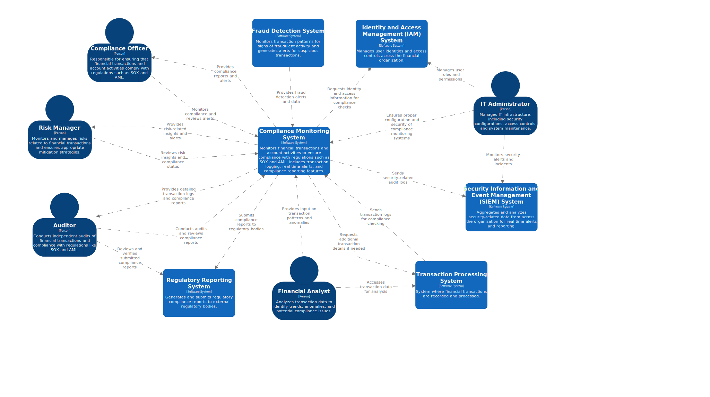
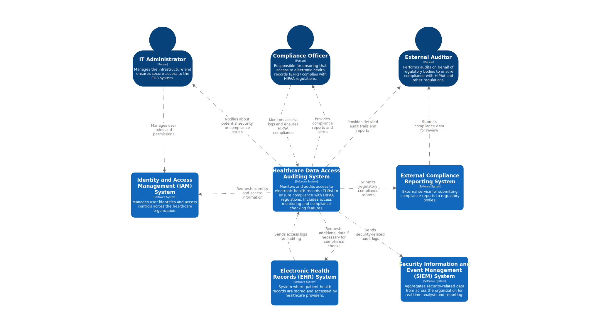

# Cloud Serverless Audit Solutions

## Overview

The Cloud Serverless Audit Solutions offer a scalable, automated, and real-time framework designed to monitor, analyze, and report on activities across an organization’s digital infrastructure. This solution minimizes operational overhead while ensuring comprehensive coverage for security, compliance, and operational efficiency. It is adaptable to diverse business needs and can be customized to meet various industry requirements.

## Benefits

1. **Scalability**: Easily handles large volumes of audit data without the need to manage server infrastructure.
2. **Real-Time Monitoring**: Provides immediate insights and alerts for suspicious activities and compliance breaches.
3. **Automation**: Automates data collection, processing, and reporting, reducing manual effort and human error.
4. **Centralized Reporting**: Offers a unified view of audit data across various systems and services, facilitating easier analysis and compliance reporting.
5. **Cost-Efficiency**: Utilizes serverless architecture to reduce costs associated with infrastructure management and scaling.

## Business Scenarios
Below are several business scenarios where Cloud Serverless Audit Solutions can be effectively applied, highlighting the benefits and use cases for each.

### #1: Financial Services Compliance Monitoring
**Scenario**: Banks and financial institutions must monitor and audit transactions and account activities to comply with regulations such as SOX (Sarbanes-Oxley) or AML (Anti-Money Laundering).

**Benefits**:
1. Automates compliance monitoring and auditing processes.
2. Provides real-time alerts for potential compliance issues.
3. Reduces costs with a scalable and pay-as-you-go model.
4. Ensures robust data security and integrity.
5. Generates detailed and accurate audit reports.
6. Maintains a reliable and secure audit trail.
7. Integrates seamlessly with existing systems.
8. Supports ongoing regulatory compliance.
9. Detects and mitigates potential fraud risks efficiently.

### #2: Healthcare Data Access Auditing
**Scenario**: Healthcare providers need to audit access to electronic health records (EHRs) to comply with HIPAA (Health Insurance Portability and Accountability Act).

**Benefits**:
1. Tracks and monitors access to electronic health records (EHRs) to ensure compliance with HIPAA regulations.
2. Provides real-time alerts for unauthorized or suspicious access attempts.
3. Generates detailed and accurate audit trails for comprehensive compliance reporting and investigations.
4. Enhances security by detecting and responding to potential breaches or policy violations.
5. Automates record-keeping and access logging to streamline compliance processes.
6. Supports scalable monitoring to accommodate growing volumes of access data.
7. Offers secure storage of audit logs to prevent tampering or data loss.
8. Facilitates easy retrieval of historical access data for audits and reviews.
9. Integrates with existing EHR systems to provide a seamless compliance solution.
10. Reduces administrative overhead and operational costs with automated auditing solutions.

### #3: Cloud Infrastructure Security Monitoring
**Scenario**: Organizations using cloud services need to monitor and audit access to cloud resources such as S3 buckets, EC2 instances, and databases to ensure security.

**Benefits**:
1. Provides real-time monitoring of access to cloud resources like S3 buckets, EC2 instances, and databases.
2. Sends instant alerts for unauthorized or suspicious access to ensure prompt action.
3. Delivers detailed logs and reports for thorough security analysis and incident investigation.
Enhances visibility into cloud resource usage and access patterns.
4. Automates security monitoring to reduce manual oversight and operational burden.
5. Ensures compliance with security policies and best practices through continuous auditing.
6. Facilitates rapid detection and response to potential security threats or vulnerabilities.
7. Maintains secure and tamper-proof logs for audit purposes and regulatory requirements.
8. Integrates seamlessly with existing cloud infrastructure for a unified security approach.
9. Scales with client's cloud environment to monitor an increasing number of resources efficiently.

### #4: Application Performance and Usage Auditing
**Scenario**: SaaS providers need to audit application usage and performance to ensure service level agreements (SLAs) and optimize performance.

**Benefits**:
1. Gathers comprehensive performance metrics and usage data for in-depth analysis.
2. Provides real-time monitoring of application health to detect and address issues promptly.
3. Delivers actionable insights for performance optimization and tuning to meet service level agreements (SLAs).
4. Tracks user interactions and usage patterns to improve application efficiency and user experience.
5. Generates detailed reports for evaluating adherence to SLAs and identifying areas for improvement.
6. Automates performance monitoring to reduce manual oversight and administrative tasks.
7. Supports proactive problem resolution by identifying potential bottlenecks or inefficiencies.
8. Offers visibility into application behavior and resource utilization for informed decision-making.
9. Integrates with existing tools and platforms to streamline performance and usage auditing.
10. Scales with application growth to ensure consistent monitoring and performance management.

### #5: Regulatory Compliance for Data Privacy
**Scenario**: Organizations in various sectors need to ensure compliance with data privacy regulations such as GDPR (General Data Protection Regulation) or CCPA (California Consumer Privacy Act).

**Benefits**:
1. Monitors and tracks data processing activities to ensure adherence to data privacy regulations.
2. Provides real-time alerts for any data access violations or breaches of privacy policies.
3. Generates detailed audit reports for comprehensive compliance reviews and regulatory reporting.
4. Enhances transparency into data handling practices and processing activities.
5. Supports automated compliance checks to streamline regulatory adherence.
6. Facilitates quick identification and remediation of privacy-related issues.
7. Ensures secure and accurate record-keeping of data processing activities.
8. Helps demonstrate compliance with GDPR, CCPA, and other data privacy regulations.
9. Integrates with existing data management systems to provide a unified compliance approach.
10. Scales with organizational growth to maintain consistent data privacy oversight.

### #6: Operational Auditing for IT Environments
**Scenario**: IT departments need to audit changes and configurations in infrastructure, including software deployments and system updates.

**Benefits**:
1. Logs and tracks all configuration changes and software deployments for detailed oversight.
2. Provides real-time alerts for unauthorized or unexpected changes to maintain system integrity.
3. Delivers comprehensive audit trails to assist in troubleshooting and diagnosing issues.
4. Enhances visibility into IT infrastructure modifications and their impacts.
5. Supports compliance with internal policies and external regulations by documenting changes.
6. Automates auditing processes to reduce manual tracking and administrative overhead.
7. Facilitates quick identification and resolution of configuration-related issues.
8. Ensures secure and accurate records of all system updates and deployments.
9. Integrates with existing IT management tools for a streamlined auditing approach.
10. Scales with IT infrastructure growth to maintain consistent operational oversight.

### #7: Supply Chain and Logistics Monitoring
**Scenario**: Retail and manufacturing companies need to audit supply chain activities, including inventory management and supplier interactions.

**Benefits**:
1. Monitors and tracks supply chain events and transactions for comprehensive oversight.
2. Provides real-time alerts for discrepancies or anomalies in inventory management and supplier interactions.
3. Generates detailed logs for in-depth operational analysis and performance evaluation.
4. Enhances visibility into supply chain activities to optimize efficiency and accuracy.
5. Supports timely identification and resolution of issues to minimize disruptions.
6. Automates auditing processes to reduce manual oversight and administrative effort.
7. Facilitates compliance with supply chain regulations and standards through accurate documentation.
8. Improves coordination and communication with suppliers by tracking interactions and transactions.
9. Integrates with existing supply chain management systems for a unified monitoring approach.
10. Scales with supply chain complexity to ensure consistent monitoring as operations grow.

### #8: User Activity and Access Control Auditing
**Scenario**: Organizations need to audit user activity and access control to ensure adherence to internal policies and security practices.

**Benefits**:
1. Monitors and tracks user logins and changes to access permissions for thorough oversight.
2. Provides real-time alerts for unusual or suspicious access patterns to enhance security.
3. Generates detailed logs for comprehensive security investigations and compliance reviews.
4. Improves visibility into user activity to ensure adherence to internal policies and security practices.
5. Facilitates prompt detection and response to potential security breaches or policy violations.
6. Automates auditing processes to reduce manual tracking and administrative workload.
7. Supports regulatory compliance by maintaining accurate records of user access and activity.
8. Enhances security by identifying and addressing unauthorized or inappropriate access promptly.
9. Integrates with existing access control systems for a seamless auditing experience.
10. Scales with organizational growth to maintain consistent monitoring of user activity.

### #9: Incident Response and Forensics
**Scenario**: Security teams need to investigate security incidents, such as data breaches or cyberattacks.

**Benefits**:
1. Collects and aggregates incident-related logs for thorough investigation and analysis.
2. Provides real-time alerts for suspicious activities to enable swift response to potential threats.
3. Delivers detailed forensic analysis and comprehensive audit trails to support incident resolution and understanding.
4. Enhances visibility into security incidents to improve response and remediation efforts.
5. Facilitates identification and tracking of attack vectors and compromised systems.
6. Automates data collection and analysis to streamline the incident response process.
7. Supports compliance with incident reporting requirements and regulatory standards.
8. Integrates with existing security tools for a cohesive and effective incident response strategy.
9. Scales with the complexity of incidents to ensure robust investigation capabilities.
10. Enhances overall security posture by identifying root causes and mitigating future risks.

### #10: Operational Efficiency and Cost Management
**Scenario**: Organizations need to audit cloud resource usage and operational costs to optimize spending.

**Benefits**:
1. Tracks and monitors cloud resource usage and associated costs for accurate financial oversight.
2. Provides real-time alerts for unusual spending patterns to prevent budget overruns.
3. Delivers insights and recommendations for cost optimization to enhance operational efficiency.
4. Enhances visibility into resource allocation and expenditure to identify areas for savings.
5. Automates cost monitoring to reduce manual oversight and administrative effort.
6. Facilitates informed decision-making by providing detailed usage and cost data.
7. Supports compliance with budgetary constraints and financial policies.
8. Integrates with existing financial and operational systems for streamlined cost management.
9. Scales with organizational growth to ensure consistent oversight of expanding cloud resources.
10. Improves overall cost efficiency by identifying and addressing inefficiencies in cloud resource usage.

### #11: Customer Data Management and Security
**Scenario**: E-commerce and customer-focused businesses need to audit customer data management practices to ensure data security.

**Benefits**:
1. Monitors and tracks customer data access and processing to ensure proper management and security.
2. Provides real-time alerts for potential data breaches or unauthorized access to safeguard customer information.
3. Generates detailed audit trails to demonstrate data security practices and enhance customer assurance.
4. Enhances visibility into data handling practices to ensure compliance with security policies and regulations.
5. Facilitates prompt detection and response to potential data security issues.
6. Automates auditing processes to reduce manual oversight and increase efficiency.
7. Supports compliance with data protection regulations and industry standards.
8. Integrates with existing data management systems for a unified approach to customer data security.
9. Scales with business growth to maintain consistent oversight as customer data volumes increase.
10. Improves overall data security posture by identifying and addressing vulnerabilities.

### #12: Data Backup and Recovery Auditing
**Scenario**: Organizations need to audit data backup and recovery processes to ensure data integrity and availability.

**Benefits**:
1. Monitors and tracks data backup activities and recovery processes to ensure data integrity and availability.
2. Provides real-time alerts for backup failures or issues to enable timely intervention and resolution.
3. Generates detailed logs to verify data integrity and confirm successful backups and recoveries.
4. Enhances visibility into backup and recovery operations to ensure adherence to policies and procedures.
5. Facilitates prompt identification and remediation of issues affecting data protection.
6. Automates auditing processes to reduce manual oversight and administrative effort.
7. Supports compliance with data protection regulations and internal backup policies.
8. Integrates with existing backup and recovery systems for a streamlined auditing experience.
9. Scales with organizational data growth to maintain consistent monitoring of backup and recovery processes.
10. Improves overall data protection strategy by identifying and addressing potential weaknesses.

## Solutions

This repository focuses on implementing Cloud Serverless Audit Solutions using the **AWS** technology stack. It provides a detailed architecture and code examples tailored for AWS services, enabling scalable, automated, and real-time auditing across various business scenarios.

However, the principles and methodologies outlined here are broadly applicable and can be replicated using similar technologies available in other cloud platforms such as Google Cloud Platform (GCP) and Microsoft Azure. Each cloud provider offers equivalent services that can be used to achieve similar auditing and monitoring capabilities. For those using GCP or Azure, you can adapt the architecture by leveraging their respective serverless technologies and services to implement a comparable solution.

## Which solution to choose?

This repository has several options of Audit as a Service design and implementation. Ingestion via API Gateway, [Amazon Firehose](./audit-as-service-streaming-firehose/) and Amazon Kinesis Data Stream. Choose a repository as your project's code or architecture reference, based on following comparison table that contrasts **API Gateway**, **Amazon Kinesis Data Firehose**, and **Amazon Kinesis Data Streams** for ingestion architectures across various criteria:

| **Criteria** | **API Gateway** | [**Amazon Firehose**](./audit-as-service-streaming-firehose/)| **Amazon Kinesis Data Streams** |
|--------------|--------------|--------------|--------------|
| **Use Case**| Low-latency API interactions (e.g., REST, HTTP). Ideal for request/response models, real-time microservices communication. | Real-time data streaming to data lakes, analytics, or monitoring tools. Automatic scaling and data transformations. | Real-time data ingestion and custom stream processing. Low-latency, high throughput use cases (e.g., IoT, logs). |
| **Scalability**| Limited by backend integration and scaling API calls. Needs manual intervention for high throughput scaling. | Automatically scales to handle large volumes of data without user intervention. | Automatically scalable, but requires shard management for throughput control. |
| **Latency**| Generally low latency for individual requests. Ideal for synchronous operations. | Medium latency. Data can be batched, transformed, and then delivered to the destination. | Low latency. Designed for real-time data ingestion and fast processing. |
| **Data Transformation**| Not built-in. Requires a Lambda function or backend service for transformation. | Built-in with AWS Lambda integration. Supports format conversions, aggregations, or enrichment. | Transformation needs to be done via custom consumers reading from the stream (e.g., Lambda or Kinesis Analytics). |
| **Real-Time Processing**| Best suited for synchronous requests, not real-time streams. Limited event streaming support via WebSocket APIs. | Real-time delivery, but buffers data before processing. Best for near real-time ingestion into S3, Redshift, Elasticsearch, etc. | Designed for real-time ingestion. Supports millisecond-level processing for real-time analytics and responses. |
| **Data Delivery**| Requires manual handling of storage and destinations (e.g., via Lambda or backend services). | Automatically delivers data to S3, Redshift, Elasticsearch, or Splunk. Supports multiple destinations. | Data is delivered to consumers, which can then process or forward data to other services. |
| **Throughput**| Limited by API Gateway’s request quotas and backend capacity (up to 10,000 RPS). | High throughput. Automatically scales for large streams of data (GBs per second). | Extremely high throughput with managed shards (up to 1 MB/s input and 2 MB/s output per shard). |
| **Batching**| No native batching support. Requests are handled individually. | Supports batching with customizable buffer sizes and intervals. | No native batching, but multiple records can be processed in a single consumer request. |
| **Cost Model**| Pay per API request, making it costly for high-volume, streaming data. Backend services add extra costs. | Pay for the amount of data ingested and processed. Ideal for large-scale, continuous streams. | Pay per shard hour and data retrieval. Can get costly if not optimized (cost depends on number of shards). |
| **Error Handling & Retries**| Manual error handling via backend services. May require custom logic for retries. | Automatic retries with backup to S3 in case of delivery failure. Provides error logging via CloudWatch. | Requires custom consumer logic to handle retries or failures. AWS Lambda can manage retry logic if used as consumer. |
| **Data Retention**| No built-in retention. Must be handled in downstream services (e.g., storing in S3, DynamoDB). | Supports S3 backups, providing data retention for long-term storage. | Configurable data retention from 24 hours up to 7 days. Supports durable streams with persistence. |
| **Integration with AWS Services**| Easily integrates with many AWS services (Lambda, DynamoDB, S3, Step Functions). Requires additional setup. | Seamless integration with S3, Redshift, Elasticsearch, Splunk. Minimal configuration needed. | Tight integration with Kinesis Analytics, Lambda, and custom consumers. Supports AWS Glue for advanced analytics. |
| **Data Buffering**| No native buffering. Requests are processed individually. | Automatic buffering with configurable time intervals or size (up to 128 MB). | No buffering natively, but data can be consumed in batches by custom consumers. |
| **Data Duplication Prevention**| No built-in prevention. Must handle idempotency in backend logic. | Ensures reliable, once-per-second delivery. Supports S3 backups for ensuring no data loss. | Supports "exactly once" processing, but custom logic is required to handle duplicate events if consumers fail. |
| **Developer Effort**| Requires significant effort to design and maintain ingestion logic, scaling, and transformation. | Minimal effort for ingestion, scaling, and transformation. Built-in connectors simplify setup. | Requires custom consumers for processing, scaling, and fault tolerance management. More developer effort than Firehose. |
| **Data Integrity**| No built-in support. Must be manually managed. Backend services or queues are used to ensure reliability. | High reliability and fault tolerance with automatic retries and S3 backup. | High durability but requires managing shard capacity and consumer error handling. |
| **Data Volume Handling**| Suitable for low to medium volumes of data (rate-limited per second). | Designed for high-volume continuous streams with automatic scaling. | Suitable for high-volume streams, but you need to manage shard count for throughput scaling. |
| **Security**| Built-in security with AWS IAM, API Keys, and Lambda authorizers. | Fully managed security with data encryption at rest and in transit. Supports IAM roles and policies. | Supports encryption in transit and at rest. Data consumers must handle security and access controls. |
| **Retention & Replay**| No built-in replay support. Needs additional infrastructure for reprocessing. | Backup to S3 allows long-term retention and replay, but no native replay within Firehose. | Supports replay for up to 7 days. Can reprocess streams within the retention window. |

## Summary
- **API Gateway**: Ideal for **synchronous, request-response based interactions** with low data throughput. Suited for REST/HTTP APIs with manageable data volumes.
- **Amazon Firehose**: Best for **high-throughput streaming data pipelines** where you want a **managed solution** that **automatically scales** and **integrates easily** with AWS data lakes or analytics tools. Only **near real-time ingestion** is offered.
- **Amazon Kinesis Data Streams**: Excellent for **real-time ingestion** where you need **low-latency processing**, but it requires **manual shard management** and custom consumers for handling stream processing.