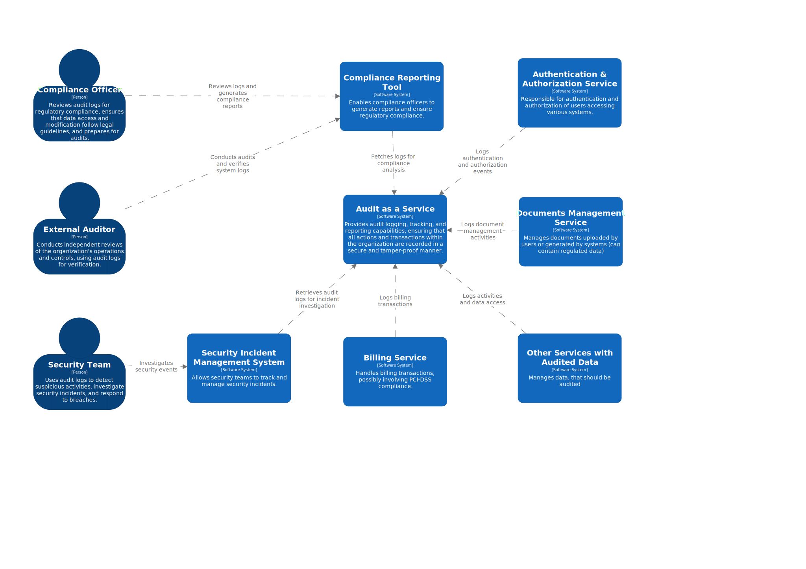
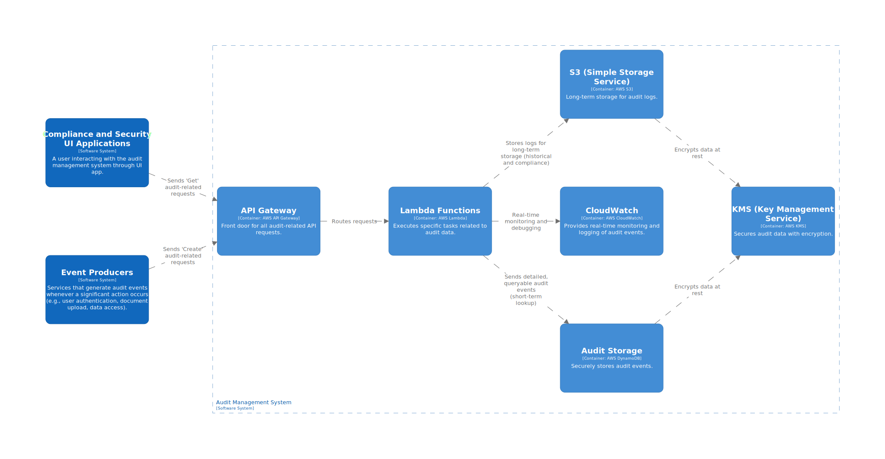

# Audit as a Service Solution with AWS Firehose

The Audit as a Service Solution (AAAS) with AWS Firehose is a powerful and scalable system designed to efficiently ingest, store, and analyze audit events across an organization. This solution leverages AWS Firehose for seamless data streaming and ingestion, ensuring that all actions and transactions are securely captured and delivered to storage or analytics platforms in near real-time.

Built to meet stringent industry standards and regulatory requirements, the solution provides comprehensive audit logging, tracking, and reporting capabilities. It guarantees that all critical events are recorded in a tamper-proof manner, providing valuable insights into system activity and supporting compliance efforts. The AWS Firehose-based approach enhances data reliability, scalability, and processing efficiency, making it ideal for organizations requiring robust audit management and real-time data streaming capabilities.

## System Context Diagram
The following System Context Diagram provides a high-level overview of how the solution interacts with external entities, including users, third-party services, and other systems within the organization.

## Container Diagram
The Container Diagram provides a detailed view of the Audit As a Service Solution's architecture at the container level. It illustrates how various components within the system interact with each other to capture, store, and analyze audit events.

## Architecture Highlights:

For most large-scale Audit as a Service architectures, Firehose based solution is sufficient and more straightforward to use if/when:

- If your primary goal is to store audit logs in S3, Elasticsearch, or Redshift for later analysis and you don’t need to process each event immediately. Firehose is designed for **near real-time data delivery**.
- When you need a straightforward, fully managed pipeline for moving audit logs from the ingestion point to a storage solution. Firehose is designed for near data delivery with minimal configuration.

In following cases, consider [Kinesis solution](#):

- If your system needs to react in **real-time** to security or compliance events, such as triggering alerts or automated actions when specific types of audit events are detected.
- When integrating with systems that require continuous real-time data flow, such as real-time dashboards or monitoring systems.

### Technology Stack

1. **API Gateway:** Acts as the front door for all audit-related API requests, handling request validation, authorization, and routing to the appropriate backend services.
2. **Audit Storage:** Utilizes AWS DynamoDB to store audit events securely. The database is optimized for quick retrieval and querying based on various attributes like timestamps, event types, and user identifiers.
3. **Lambda Functions:** Executes specific tasks such as ingesting audit data, processing audit logs, and triggering alerts for anomalous activities.
4. **CloudWatch:** Provides real-time monitoring and logging of audit events, enabling administrators to gain insights into system activity and identify potential issues.
5. **S3 (Simple Storage Service):** Provides long-term storage for audit logs. S3 ensures durability and scalability for storing large volumes of audit data over extended periods, with configurable lifecycle policies for cost-effective management.
6. **KMS (Key Management Service):** Secures audit data by managing encryption keys, ensuring that sensitive information is protected both in transit and at rest.

## Processes Documentation
1. [Audit Event Ingestion and Processing](https://github.com/daria-serkova/aws-cdk/tree/main/audit-services/audit-as-service/architecture/audit-event-ingestion)
2. [Audit Data Storage and Retrieval](#)
3. [Audit Reporting and Analysis](#)
4. [Audit Data Security and Compliance](#)
5. [Audit Event Search and Indexing](#)
6. [Audit Alerts and Notifications](#)
7. [Audit Backup and Disaster Recovery](#)
8. [Audit Data Integration with Other Systems](#)
9. [Postman collection location](#)

Please refer to the respective documents and diagrams within this folder for details.