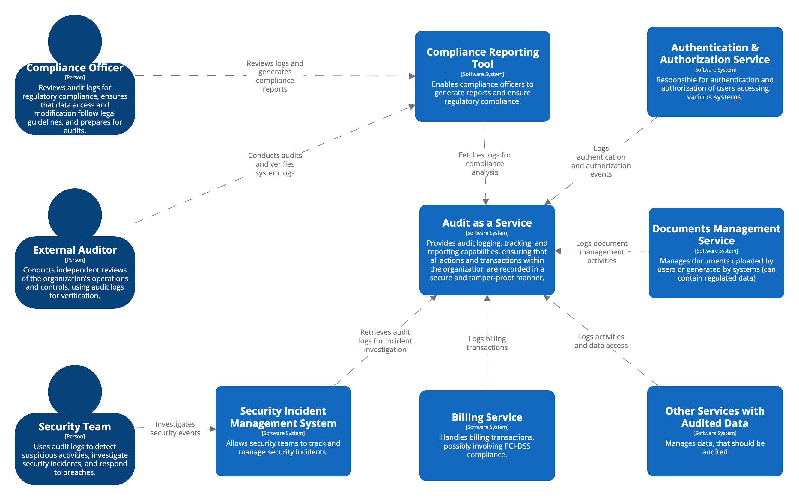
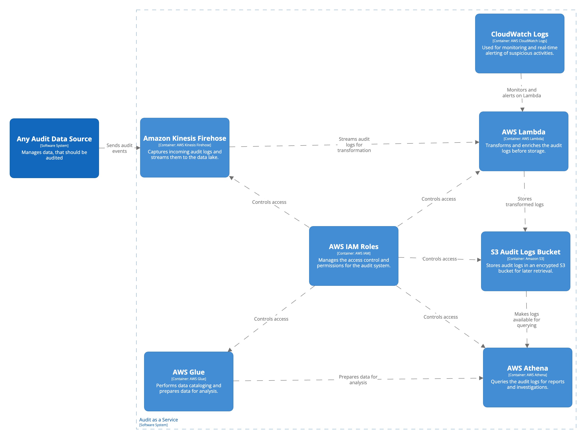

# Audit as a Service Solution with AWS Firehose

The Audit as a Service Solution (AAAS) with AWS Firehose is a powerful and scalable system designed to efficiently ingest, store, and analyze audit events across an organization. This solution leverages AWS Firehose for seamless data streaming and ingestion, ensuring that all actions and transactions are securely captured and delivered to storage or analytics platforms in near real-time.

Built to meet stringent industry standards and regulatory requirements, the solution provides comprehensive audit logging, tracking, and reporting capabilities. It guarantees that all critical events are recorded in a tamper-proof manner, providing valuable insights into system activity and supporting compliance efforts. The AWS Firehose-based approach enhances data reliability, scalability, and processing efficiency, making it ideal for organizations requiring robust audit management and real-time data streaming capabilities.

## System Context Diagram
The following System Context Diagram provides a high-level overview of how the solution interacts with external entities, including users, third-party services, and other systems within the organization.

## Architecture Highlights

For most large-scale Audit as a Service architectures, Firehose based solution is sufficient and more straightforward to use if/when:

- If your primary goal is to store audit logs in S3, Elasticsearch, or Redshift for later analysis and you don’t need to process each event immediately. Firehose is designed for **near real-time data delivery**.
- When you need a straightforward, fully managed pipeline for moving audit logs from the ingestion point to a storage solution. Firehose is designed for near data delivery with minimal configuration.

In following cases, consider [Kinesis solution](#):

- If your system needs to react in **real-time** to security or compliance events, such as triggering alerts or automated actions when specific types of audit events are detected.
- When integrating with systems that require continuous real-time data flow, such as real-time dashboards or monitoring systems.

## Technology Stack

This project leverages a range of AWS services and related technologies to deliver a robust, serverless Audit as a Service solution. The following sections describe the primary components of the architecture:

1. **Amazon Kinesis Firehose**
   - **Purpose**: Ingests and streams audit logs into the system.
   - **Functionality**: Firehose captures log data in real-time and streams it to an S3 bucket for further processing, ensuring all audit events are efficiently collected.
   - **Why It's Used**: Provides a scalable, fully managed data streaming service, ideal for ingesting high-volume audit data.

2. **AWS Lambda**
   - **Purpose**: Handles transformation and enrichment of audit logs.
   - **Functionality**: Lambda functions are triggered to process logs in real-time. They handle tasks like formatting, data validation, and enrichment before the logs are stored.
   - **Why It's Used**: Enables real-time, serverless compute without the need to manage infrastructure, allowing for efficient log processing at scale.

3. **Amazon S3**
   - **Purpose**: Secure storage of audit logs.
   - **Functionality**: Logs are stored in S3 in an encrypted and durable manner. S3 is also integrated with lifecycle policies to manage long-term storage and retention of audit logs.
   - **Why It's Used**: Provides scalable, secure, and cost-effective storage for audit logs, ensuring durability and availability.

4. **AWS Glue**
   - **Purpose**: Catalogs and prepares audit logs for analysis.
   - **Functionality**: Glue automatically catalogs logs stored in S3 and enables advanced data processing and ETL (Extract, Transform, Load) operations to prepare logs for querying.
   - **Why It's Used**: Simplifies data cataloging and ETL processes, making audit logs queryable and usable for compliance and incident investigations.

5. **AWS Athena**
   - **Purpose**: On-demand querying of audit logs.
   - **Functionality**: Athena uses the Glue Data Catalog to run SQL queries against the stored audit logs without the need for infrastructure management.
   - **Why It's Used**: Provides a scalable, serverless query service that allows security and compliance teams to quickly analyze audit data.

6. **Amazon CloudWatch**
   - **Purpose**: Real-time monitoring and alerting.
   - **Functionality**: CloudWatch tracks metrics and logs, and it is used to set up alarms and notifications for suspicious activities or anomalies detected in audit logs.
   - **Why It's Used**: Delivers monitoring capabilities to ensure system health and security, providing timely alerts for incident management.

7. **AWS IAM (Identity and Access Management)**
   - **Purpose**: Manages access control and security.
   - **Functionality**: IAM roles and policies govern access to different components of the system, ensuring secure interaction between services and users.
   - **Why It's Used**: Enforces the principle of least privilege, ensuring that only authorized services and users can access sensitive audit data.

## Supported Processes
1. [Audit Event Ingestion and Processing](./audit-event-ingestion-and-processing/)

Please refer to the respective documents and diagrams within this folder for details.

## Cost Calculation
The cost of running an audit solution with such architecture for a application that adheres to HIPAA, PII and PCI-DSS regulations (for example healthcare platform, where almsot all events should be audited) depends on the frequency of audit events generated and the use of AWS services for ingestion, processing, storage, and querying. Below is a sample cost breakdown based on the following use case:

**Use Case Assumptions**:

1. 10,000 healthcare providers and 10,000 patients use the system regularly.
2. Each user generates an average of 20 audit events per day (e.g., logging in, uploading documents, viewing medical records, scheduling appointments).
3. Size of the audit event JSON is maximum 1 KB max. 
4. This results in 400,000 audit events per day and 12 million audit events per month.

The estimated monthly cost for running this healthcare application with audit events for every single action (due to HIPAA and PII regulations) is **~$17/month**. Detailed breakdown is documented in the [cost-estimate.xlsx](cost-estimate.xlsx) file.