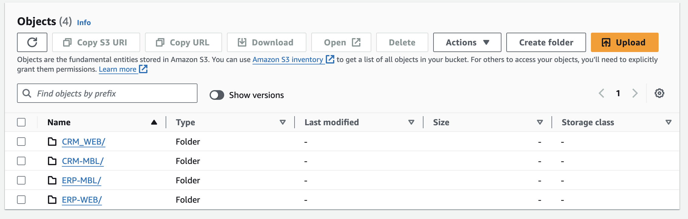
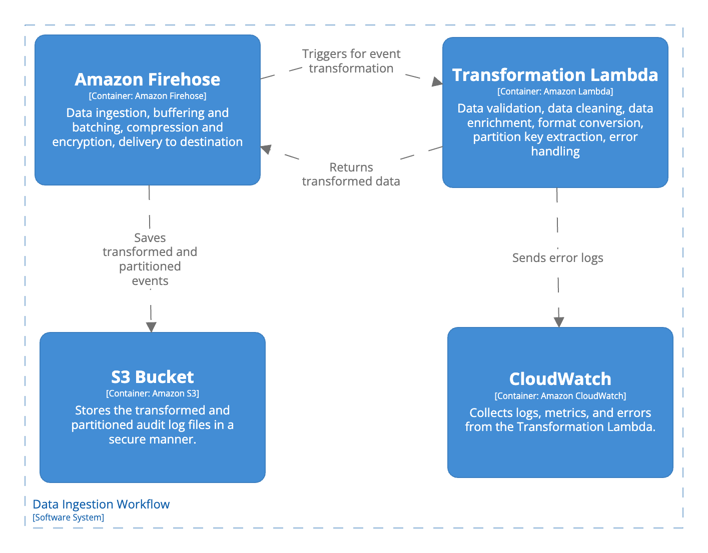

# Audit Events Ingestion

- [Audit Events Ingestion](#audit-events-ingestion)
- [Overview](#overview)
- [Events Stream Sources](#events-stream-sources)
  - [Overview](#overview-1)
  - [Sample of Supported Event Sources](#sample-of-supported-event-sources)
  - [Required Configuration](#required-configuration)
  - [Integration Approach](#integration-approach)
- [Events Stream Ingestion](#events-stream-ingestion)
  - [Workflow](#workflow)
  - [Amazon Firehose Configuration](#amazon-firehose-configuration)
  - [Amazon Lambda Configuration](#amazon-lambda-configuration)
  - [Amazon S3 Configuration](#amazon-s3-configuration)
  - [Amazon CloudWatch Configuration](#amazon-cloudwatch-configuration)
- [Supported Events Types](#supported-events-types)

# Overview
Audit Events Ingestion is the foundational process within an Audit As a Service (AaaS) solution that captures and records events from various systems, applications, and services within an organization. This process ensures that all relevant activities and transactions are logged in a structured and consistent manner, enabling comprehensive auditing, monitoring, and compliance management.
# Events Stream Sources
## Overview
Event sources represent the various systems, applications, and services from which audit events are collected within an organization. These sources can vary widely depending on the organization's technology stack and operational needs. 

The [utils.ts file (SupportedInitiatorSystemCodes)](./../../helpers/utils.ts) is used to configure and manage the supported event sources. It ensures that each event includes the appropriate initiatorSystemCode value to accurately identify the source of the event. This configuration file is critical for maintaining consistency and traceability of audit events across different systems and services. By defining these sources and their corresponding initiatorSystemCode values, organizations can ensure that their audit logs are comprehensive, reliable, and traceable back to the originating systems. This facilitates better monitoring, compliance, and analysis of organizational activities.
## Sample of Supported Event Sources

1. CRM-WEB: Customer Relationship Management (CRM) System (Web Application)
2. CRM-MBL: Customer Relationship Management (CRM) System (Mobile Application)
3. ERP-WEB: Enterprise Resource Planning (ERP) System (Web App)
4. etc...

## Required Configuration
Project team will need to add their source application to the [supported list](./../../helpers/utils.ts) before starting to send ingestion requests to Audit Service.

**NOTE:** initiatorSystemCode is used as a dynamic partition key and will represent top level folder within Audit S3 bucket. If value is not provided or is not from the supported list - ingestion of the event will be rejected by the service.



## Integration Approach

Event source (for example, Lambda, that processes actions in the application) can integrate with Audit Service through AWS SDK. For that following steps need to be done on the event source side:

1. Install AWS SDK for your programming language (e.g., JavaScript, Python, or Java).
2. Configure AWS credentials in your data source application to allow access to the Amazon Firehose service. Use an IAM role with appropriate permissions to write to the Firehose delivery stream.
3. Send Audit Event data. Sample:

```
import { Firehose } from 'aws-sdk';
const firehose = new Firehose({ region: process.env.REGION });
const record = { // Ensure JSON match allowed schema, otherwise ingestion of the event will be rejected by the service
        Data: JSON.stringify({
            initiatorsystemcode: "CRM_WEB",
            eventtype: "LOGIN_SUCCESSFUL",
            requestorid: "user123",
            requestorip: "192.168.1.10",
            timestamp: "1723261726286",
            devicetype: "mobile",
            devicemodel: "iPhone 12",
            devicebrowsername: "Safari",
            deviceosname: "iOS",
            deviceosversion: "14.4",
            loginmethod: "PASSWORD",
            sessionid: "abc123sessionid",
            sessionstarttime: "1723257726286",
            sessionexpirationtime: "1723261726286"
        }),
    };
    const params = {
        DeliveryStreamName: process.env.AUDIT_EVENTS_DATA_STREAM,
        Record: record,
    };
    try {
        const result = await firehose.putRecord(params).promise();
    } catch (err) {
        console.error('Error adding record to Firehose:', err);
    }
```
# Events Stream Ingestion

The ingestion layer for the Audit as a Service solution utilizes AWS Firehose to handle and process large volumes of audit events from distributed agents and various data sources. AWS Firehose provides a reliable and scalable way to stream data into AWS, ensuring that audit events are ingested, transformed, and delivered with minimal latency.

## Workflow



## Amazon Firehose Configuration

In this solution, Firehose serves as the backbone for data ingestion, ensuring that incoming audit events are buffered and batched for optimal delivery to the storage destination.

Firehose is configured to handle several critical tasks:

| # | Task | Description | Configuration |
|---|------|-------------|---------------|
| 1 | Data Ingestion | Streams audit event data in real-time from various sources into the system.  | 1. **Source:** Direct PUT,</br> 2. **Data format:** [JSON](#supported-events-types). Only JSONs, that match [provided schema](./../../helpers/utils.ts) will be processed,</br> 3. **Retry Duration:** 300 seconds (5 minutes). Ensures that data isn't immediately discarded if a transient error (network issues,resource contention, throttling, etc) occurs during dynamic partitioning. |
| 2 | Buffering and Batching | Buffers and batches data to optimize performance and reduce write frequency. | 1. **Buffer Size:** 64 MB (minimum required config for dynamic partition),</br> 2. **Buffer Interval:** 300 seconds (5 minutes)</br>|
| 3 | Compression | Compresses data before storing to reduce storage costs and enhance performance. | **Compression Format:** GZIP |
| 4 | Encryption | Ensures that data is encrypted in transit and at rest for security purposes. | 1. **At-rest Encryption:** AWS KMS (Key Management Service). This solution uses default AWS managed keys as they meet the encryption at rest requirement for such regulations as HIPAA, PCI-DSS, etc. If organization security requirements are more strict and need better control over encryption keys and their usage, solution should be changed with Customer Managed Key for Firehose</br> 2. **In-transit Encryption:** TLS 1.2. Firehose automatically encrypts data in transit using TLS 1.2. This ensures that data sent from the producer to Firehose is encrypted.|
| 5 | Delivery to Destination  | Delivers transformed and enriched data to a designated storage destination.  | **Destination:** Amazon S3, **Backup Mode:** Disabled (unless failure scenarios require it), **Prefix:** `initiatorsystemcode/eventtype/year=2024/month=09/day=05` |

This format ensures clarity on each task Firehose performs and provides the standard configuration that is usually recommended for an audit logging service.

## Amazon Lambda Configuration

TBD
## Amazon S3 Configuration

TBD

## Amazon CloudWatch Configuration

TBD


# Supported Events Types

This audit service supports following types of audit events out-of-the-box:

1. [Use Access](https://github.com/daria-serkova/aws-cdk/tree/main/audit-services/audit-as-service/architecture/audit-event-ingestion/user-access)
2. [User Account Managment](https://github.com/daria-serkova/aws-cdk/tree/main/audit-services/audit-as-service/architecture/audit-event-ingestion/user-account-management)
3. [Documents Management](https://github.com/daria-serkova/aws-cdk/tree/main/audit-services/audit-as-service/architecture/audit-event-ingestion/documents-management)

List is configured inside file `aws-cdk/audit-services/audit-as-service/helpers/utils.ts` (SupportedEventTypes)

Allowed attributes for different type of audit events also configured on the API Request Model side: `aws-cdk/audit-services/audit-as-service/lib/resources/api-gateway.ts` (auditStoreEventsEndpoin -> requestModel)

All additional events need to be added by project team before starting to send ingestion requests to Audit Service.
