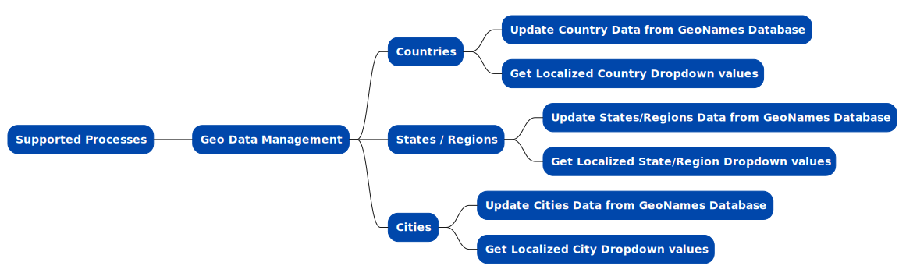

# Geolocation Data Storage and Retrieval

In any geolocation data management system focused on storing information about geographical entities, ensuring secure and scalable storage is crucial. This includes managing detailed records of country names, city names, and state/province details in verious languages, coordinates and hierarchy information. Efficient organization and retrieval of this data are essential for supporting applications that rely on geographic information, such as location-based services, geographic analysis, and regional data management. Key aspects include maintaining accurate and up-to-date records, supporting fast and efficient queries for geographic data, and ensuring data integrity and accessibility for various business needs.

## Supported Processes

1. [Update Country Data from GeoNames Database](./update-countries/)
2. [Get Localized Country Dropdown values](./retrieve-countries-dropdown/)
3. [Update States/Regions Data from GeoNames Database](./update-states/)
4. [Get Localized State/Region Dropdown values](./retrieve-states-dropdown/)
5. [Update Cities Data from GeoNames Database](./update-cities/)
6. [Get Localized City Dropdown values](./retrieve-cities-dropdown/)