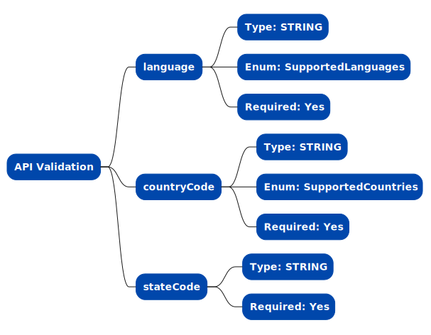

# Process: Get Localized City Dropdown Values

The Get Localized City Dropdown Values process is a key component within the data access layer, designed to provide applications with an efficient and reliable method to retrieve a list of cities stored inside the organization's data layer. This process is essential for functionalities that require accurate and up-to-date city information, such as regional configurations, city-specific services, and localization.

This API endpoint retrieves the list of cities in the language specified in the request, ensuring that the information is relevant and understandable to the user. By organizing and accessing the data from the database, the process guarantees prompt and precise retrieval of city data. This is crucial for applications that require a multilingual repository of city information, enabling seamless integration and access across various services.

## Process


## API Details

### Overview

The Get Localized Cities Dropdown Values API is designed to streamline the retrieval of cities information in the format {label: '', value: ''}, making it ideal for scenarios where global applications require accurate and localized cities data. 

### API Endpoint

```
{{API_GATEWAY_URL}}/geo/city/get-dropdown-values
```

### API Supported Methods

POST

### API Authorization

Security header X-API-Key (generated API Gateway key) is required.

### API Request Model Validation

API endpoint conducts following validation checks on the request's body before routing it for processing.



Lists of supported languages and countryCodes for body parameter value, are configured in the [Utilities file](./../../../helpers/utilities.ts).

### API Request Format

Body format:
```
{
    "language": "en",
    "countryCode": "US",
    "stateCode": "PA"
}
```

### API Response Format

Sample of the response from AWS service (English):
```
[
    {
        "value": 5178127,
        "label": "Allentown"
    },
    {
        "value": 5179446,
        "label": "Beaver"
    },
    {
        "value": 5179630,
        "label": "Bedford"
    },
    {
        "value": 5179799,
        "label": "Bellefonte"
    },
    {
        "value": 5180934,
        "label": "Bloomsburg"
    },
    {
        "value": 5181828,
        "label": "Brookville"
    },
    {
        "value": 5182534,
        "label": "Butler"
    },
    {
        "value": 5183234,
        "label": "Carlisle"
    },
    {
        "value": 4557109,
        "label": "Chambersburg"
    },
    {
        "value": 5184422,
        "label": "Clarion"
    },
    {
        "value": 5184541,
        "label": "Clearfield"
    },
    {
        "value": 5185531,
        "label": "Coudersport"
    },
    {
        "value": 5186327,
        "label": "Danville"
    },
    {
        "value": 5187247,
        "label": "Doylestown"
    },
    {
        "value": 5188140,
        "label": "Easton"
    },
    {
        "value": 5188193,
        "label": "Ebensburg"
    },
    {
        "value": 5188737,
        "label": "Emporium"
    },
    {
        "value": 5188843,
        "label": "Erie"
    },
    {
        "value": 5190323,
        "label": "Franklin"
    },
    {
        "value": 4558183,
        "label": "Gettysburg"
    },
    {
        "value": 5192029,
        "label": "Greensburg"
    },
    {
        "value": 5192726,
        "label": "Harrisburg"
    },
    {
        "value": 5193920,
        "label": "Hollidaysburg"
    },
    {
        "value": 5194099,
        "label": "Honesdale"
    },
    {
        "value": 5194590,
        "label": "Huntingdon"
    },
    {
        "value": 5194868,
        "label": "Indiana"
    },
    {
        "value": 5195460,
        "label": "Jim Thorpe"
    },
    {
        "value": 5196357,
        "label": "Kittanning"
    },
    {
        "value": 5197079,
        "label": "Lancaster"
    },
    {
        "value": 5197171,
        "label": "Laporte"
    },
    {
        "value": 5197517,
        "label": "Lebanon"
    },
    {
        "value": 5197842,
        "label": "Lewisburg"
    },
    {
        "value": 5197850,
        "label": "Lewistown"
    },
    {
        "value": 5198635,
        "label": "Lock Haven"
    },
    {
        "value": 4559516,
        "label": "McConnellsburg"
    },
    {
        "value": 5200644,
        "label": "Meadville"
    },
    {
        "value": 4559575,
        "label": "Media"
    },
    {
        "value": 5200798,
        "label": "Mercer"
    },
    {
        "value": 5201006,
        "label": "Middleburg"
    },
    {
        "value": 5201085,
        "label": "Mifflintown"
    },
    {
        "value": 5201117,
        "label": "Milford"
    },
    {
        "value": 5201805,
        "label": "Montrose"
    },
    {
        "value": 5203112,
        "label": "New Bloomfield"
    },
    {
        "value": 5203127,
        "label": "New Castle"
    },
    {
        "value": 5203506,
        "label": "Norristown"
    },
    {
        "value": 4560349,
        "label": "Philadelphia"
    },
    {
        "value": 5206379,
        "label": "Pittsburgh"
    },
    {
        "value": 5207080,
        "label": "Pottsville"
    },
    {
        "value": 5207728,
        "label": "Reading"
    },
    {
        "value": 5208292,
        "label": "Ridgway"
    },
    {
        "value": 5211303,
        "label": "Scranton"
    },
    {
        "value": 5212582,
        "label": "Smethport"
    },
    {
        "value": 5212853,
        "label": "Somerset"
    },
    {
        "value": 5214814,
        "label": "Sunbury"
    },
    {
        "value": 5215696,
        "label": "Tionesta"
    },
    {
        "value": 5215859,
        "label": "Towanda"
    },
    {
        "value": 5216260,
        "label": "Tunkhannock"
    },
    {
        "value": 4561859,
        "label": "Uniontown"
    },
    {
        "value": 5218023,
        "label": "Warren"
    },
    {
        "value": 5218069,
        "label": "Washington"
    },
    {
        "value": 4562078,
        "label": "Waynesburg"
    },
    {
        "value": 5218450,
        "label": "Wellsboro"
    },
    {
        "value": 4562144,
        "label": "West Chester"
    },
    {
        "value": 5219585,
        "label": "Williamsport"
    },
    {
        "value": 4562407,
        "label": "York"
    }
]
```

### API Limitations

Data, retrieved by API endpoint is sourced from [GeoNames database](https://www.geonames.org/). For some of the languages there is no translation in place and has to be managed manually by organization if needed. For example this is a list of translations for USA PA cities in Russian language (some values are not translated and present in English only):

```
[
    {
        "value": 5179446,
        "label": "Beaver"
    },
    {
        "value": 5179799,
        "label": "Bellefonte"
    },
    {
        "value": 5181828,
        "label": "Brookville"
    },
    {
        "value": 5182534,
        "label": "Butler"
    },
    {
        "value": 5183234,
        "label": "Carlisle"
    },
    {
        "value": 4557109,
        "label": "Chambersburg"
    },
    {
        "value": 5184422,
        "label": "Clarion"
    },
    {
        "value": 5184541,
        "label": "Clearfield"
    },
    {
        "value": 5185531,
        "label": "Coudersport"
    },
    {
        "value": 5186327,
        "label": "Danville"
    },
    {
        "value": 5188193,
        "label": "Ebensburg"
    },
    {
        "value": 5188737,
        "label": "Emporium"
    },
    {
        "value": 5192029,
        "label": "Greensburg"
    },
    {
        "value": 5193920,
        "label": "Hollidaysburg"
    },
    {
        "value": 5194099,
        "label": "Honesdale"
    },
    {
        "value": 5194590,
        "label": "Huntingdon"
    },
    {
        "value": 5195460,
        "label": "Jim Thorpe"
    },
    {
        "value": 5197171,
        "label": "Laporte"
    },
    {
        "value": 5197517,
        "label": "Lebanon"
    },
    {
        "value": 5197842,
        "label": "Lewisburg"
    },
    {
        "value": 5198635,
        "label": "Lock Haven"
    },
    {
        "value": 4559516,
        "label": "McConnellsburg"
    },
    {
        "value": 4559575,
        "label": "Media"
    },
    {
        "value": 5201006,
        "label": "Middleburg"
    },
    {
        "value": 5201085,
        "label": "Mifflintown"
    },
    {
        "value": 5201805,
        "label": "Montrose"
    },
    {
        "value": 5203112,
        "label": "New Bloomfield"
    },
    {
        "value": 5203127,
        "label": "New Castle"
    },
    {
        "value": 5203506,
        "label": "Norristown"
    },
    {
        "value": 5207080,
        "label": "Pottsville"
    },
    {
        "value": 5208292,
        "label": "Ridgway"
    },
    {
        "value": 5212582,
        "label": "Smethport"
    },
    {
        "value": 5214814,
        "label": "Sunbury"
    },
    {
        "value": 5215696,
        "label": "Tionesta"
    },
    {
        "value": 5215859,
        "label": "Towanda"
    },
    {
        "value": 5216260,
        "label": "Tunkhannock"
    },
    {
        "value": 4561859,
        "label": "Uniontown"
    },
    {
        "value": 4562078,
        "label": "Waynesburg"
    },
    {
        "value": 5218450,
        "label": "Wellsboro"
    },
    {
        "value": 4562144,
        "label": "West Chester"
    },
    {
        "value": 5178127,
        "label": "Аллентаун"
    },
    {
        "value": 5179630,
        "label": "Бедфорд"
    },
    {
        "value": 5180934,
        "label": "Блумсберг"
    },
    {
        "value": 5218069,
        "label": "Вашингтон"
    },
    {
        "value": 5192726,
        "label": "Гаррисберг"
    },
    {
        "value": 4558183,
        "label": "Геттисберг"
    },
    {
        "value": 5187247,
        "label": "Дойлстаун"
    },
    {
        "value": 5194868,
        "label": "Индиана"
    },
    {
        "value": 5188140,
        "label": "Истон"
    },
    {
        "value": 4562407,
        "label": "Йорк"
    },
    {
        "value": 5196357,
        "label": "Киттаннинг"
    },
    {
        "value": 5197079,
        "label": "Ланкастер"
    },
    {
        "value": 5197850,
        "label": "Льюистаун"
    },
    {
        "value": 5200798,
        "label": "Мерсер"
    },
    {
        "value": 5200644,
        "label": "Мидвилл"
    },
    {
        "value": 5201117,
        "label": "Милфорд"
    },
    {
        "value": 5206379,
        "label": "Питтсбург"
    },
    {
        "value": 5207728,
        "label": "Рединг"
    },
    {
        "value": 5211303,
        "label": "Скрантон"
    },
    {
        "value": 5212853,
        "label": "Сомерсет"
    },
    {
        "value": 5219585,
        "label": "Уильямспорт"
    },
    {
        "value": 5218023,
        "label": "Уоррен"
    },
    {
        "value": 4560349,
        "label": "Филадельфия"
    },
    {
        "value": 5190323,
        "label": "Франклин"
    },
    {
        "value": 5188843,
        "label": "Эри"
    }
]
```