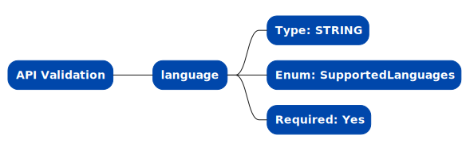

# Process: Get Localized Country Dropdown values

The Get Localized Country Dropdown Values process is a key element within the data access layer, designed to provide applications with an efficient and reliable method to retrieve a list of countries stored inside organization's data layer. This process is essential for functionalities that require accurate and up-to-date country information, such as global configurations, country-specific services, and localization.

This API endpoint retrieves the list of countries in the language specified in the request, ensuring that the information is relevant and understandable to the user. By organizing and accessing the data from data base, the process guarantees prompt and precise retrieval of country data. This is crucial for applications that require a multilingual repository of country information, enabling seamless integration and access across various services.

## Process


## API Details

### Overview

The Get Localized Country Dropdown Values API is designed to streamline the retrieval of country information in the format {label: '', value: ''}, making it ideal for scenarios where global applications require accurate and localized country data. 

### API Endpoint

```
{{API_GATEWAY_URL}}/geo/country/get-dropdown-values
```

### API Supported Methods

POST

### API Authorization

Security header X-API-Key (generated API Gateway key) is required.

### API Request Model Validation

API endpoint conducts following validation checks on the request's body before routing it for processing.



Lists of supported languages and countryCodes for body parameter value, are configured in the [Utilities file](./../../../helpers/utilities.ts).

### API Request Format

Body format:
```
{
    "language": "en"
}
```

### API Response Format

Sample of the response from AWS service (English):
```
[
    {
        "value": "CA",
        "label": "Canada"
    },
    {
        "value": "IN",
        "label": "India"
    },
    {
        "value": "RU",
        "label": "Russia"
    },
    {
        "value": "US",
        "label": "United States"
    }
]
```
Sample of the response from AWS service (Hindi):
```
[
    {
        "value": "CA",
        "label": "कनाडा"
    },
    {
        "value": "IN",
        "label": "भारत"
    },
    {
        "value": "RU",
        "label": "रूस"
    },
    {
        "value": "US",
        "label": "संयुक्त राज्य अमेरिका"
    }
]
```