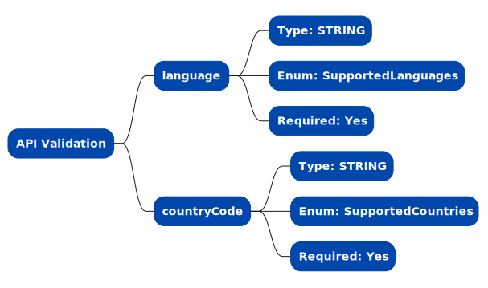

# Process: Get Localized State Dropdown Values

The Get Localized State Dropdown Values process is a key component within the data access layer, designed to provide applications with an efficient and reliable method to retrieve a list of states stored inside the organization's data layer. This process is essential for functionalities that require accurate and up-to-date state information, such as regional configurations, state-specific services, and localization.

This API endpoint retrieves the list of states in the language specified in the request, ensuring that the information is relevant and understandable to the user. By organizing and accessing the data from the database, the process guarantees prompt and precise retrieval of state data. This is crucial for applications that require a multilingual repository of state information, enabling seamless integration and access across various services.

## Process


## API Details

### Overview

The Get Localized States Dropdown Values API is designed to streamline the retrieval of states/regions information in the format {label: '', value: ''}, making it ideal for scenarios where global applications require accurate and localized states/regions data. 

### API Endpoint

```
{{API_GATEWAY_URL}}/geo/state/get-dropdown-values
```

### API Supported Methods

POST

### API Authorization

Security header X-API-Key (generated API Gateway key) is required.

### API Request Model Validation

API endpoint conducts following validation checks on the request's body before routing it for processing.



Lists of supported languages and countryCodes for body parameter value, are configured in the [Utilities file](./../../../helpers/utilities.ts).

### API Request Format

Body format:
```
{
    "language": "en",
    "countryCode": "US"
}
```

### API Response Format

Sample of the response from AWS service (English):
```
[
    {
        "value": "AL",
        "label": "Alabama"
    },
    {
        "value": "AK",
        "label": "Alaska"
    },
    {
        "value": "AZ",
        "label": "Arizona"
    },
    {
        "value": "AR",
        "label": "Arkansas"
    },
    {
        "value": "CA",
        "label": "California"
    },
    {
        "value": "CO",
        "label": "Colorado"
    },
    {
        "value": "CT",
        "label": "Connecticut"
    },
    {
        "value": "DE",
        "label": "Delaware"
    },
    {
        "value": "DC",
        "label": "District of Columbia"
    },
    {
        "value": "FL",
        "label": "Florida"
    },
    {
        "value": "GA",
        "label": "Georgia"
    },
    {
        "value": "HI",
        "label": "Hawaii"
    },
    {
        "value": "ID",
        "label": "Idaho"
    },
    {
        "value": "IL",
        "label": "Illinois"
    },
    {
        "value": "IN",
        "label": "Indiana"
    },
    {
        "value": "IA",
        "label": "Iowa"
    },
    {
        "value": "KS",
        "label": "Kansas"
    },
    {
        "value": "KY",
        "label": "Kentucky"
    },
    {
        "value": "LA",
        "label": "Louisiana"
    },
    {
        "value": "ME",
        "label": "Maine"
    },
    {
        "value": "MD",
        "label": "Maryland"
    },
    {
        "value": "MA",
        "label": "Massachusetts"
    },
    {
        "value": "MI",
        "label": "Michigan"
    },
    {
        "value": "MN",
        "label": "Minnesota"
    },
    {
        "value": "MS",
        "label": "Mississippi"
    },
    {
        "value": "MO",
        "label": "Missouri"
    },
    {
        "value": "MT",
        "label": "Montana"
    },
    {
        "value": "NE",
        "label": "Nebraska"
    },
    {
        "value": "NV",
        "label": "Nevada"
    },
    {
        "value": "NH",
        "label": "New Hampshire"
    },
    {
        "value": "NJ",
        "label": "New Jersey"
    },
    {
        "value": "NM",
        "label": "New Mexico"
    },
    {
        "value": "NY",
        "label": "New York"
    },
    {
        "value": "NC",
        "label": "North Carolina"
    },
    {
        "value": "ND",
        "label": "North Dakota"
    },
    {
        "value": "OH",
        "label": "Ohio"
    },
    {
        "value": "OK",
        "label": "Oklahoma"
    },
    {
        "value": "OR",
        "label": "Oregon"
    },
    {
        "value": "PA",
        "label": "Pennsylvania"
    },
    {
        "value": "RI",
        "label": "Rhode Island"
    },
    {
        "value": "SC",
        "label": "South Carolina"
    },
    {
        "value": "SD",
        "label": "South Dakota"
    },
    {
        "value": "TN",
        "label": "Tennessee"
    },
    {
        "value": "TX",
        "label": "Texas"
    },
    {
        "value": "UT",
        "label": "Utah"
    },
    {
        "value": "VT",
        "label": "Vermont"
    },
    {
        "value": "VA",
        "label": "Virginia"
    },
    {
        "value": "WA",
        "label": "Washington"
    },
    {
        "value": "WV",
        "label": "West Virginia"
    },
    {
        "value": "WI",
        "label": "Wisconsin"
    },
    {
        "value": "WY",
        "label": "Wyoming"
    }
]
```

### API Limitations

Data, retrieved by API endpoint is sourced from [GeoNames database](https://www.geonames.org/). For some of the languages there is no translation in place and has to be managed manually by organization if needed. For example this is a list of translations for USA states in Hindi language (some values are not translated and present in English only):
```
[
    {
        "value": "DC",
        "label": "Washington DC"
    },
    {
        "value": "AR",
        "label": "अरकांसास"
    },
    {
        "value": "AL",
        "label": "अलाबामा"
    },
    {
        "value": "AK",
        "label": "अलास्का"
    },
    {
        "value": "ID",
        "label": "आयडहो"
    },
    {
        "value": "IA",
        "label": "आयोवा"
    },
    {
        "value": "IN",
        "label": "इण्डियाना"
    },
    {
        "value": "IL",
        "label": "इलिनॉय"
    },
    {
        "value": "ND",
        "label": "उत्तर डेकोटा"
    },
    {
        "value": "NC",
        "label": "उत्तरी केरोलिना"
    },
    {
        "value": "AZ",
        "label": "एरीजोना"
    },
    {
        "value": "OK",
        "label": "ओक्लाहोमा"
    },
    {
        "value": "OH",
        "label": "ओहायो"
    },
    {
        "value": "OR",
        "label": "औरिगन"
    },
    {
        "value": "CT",
        "label": "कनेक्टिकट"
    },
    {
        "value": "KY",
        "label": "केन्टकी"
    },
    {
        "value": "KS",
        "label": "केन्सास"
    },
    {
        "value": "CA",
        "label": "कैलिफ़ोर्निया"
    },
    {
        "value": "CO",
        "label": "कॉलराडो"
    },
    {
        "value": "GA",
        "label": "जॉर्जिया"
    },
    {
        "value": "TX",
        "label": "टॅक्सस"
    },
    {
        "value": "TN",
        "label": "टेनेसी"
    },
    {
        "value": "DE",
        "label": "डेलावेयर"
    },
    {
        "value": "SC",
        "label": "दक्षिणी केरोलाइना"
    },
    {
        "value": "NM",
        "label": "नया मेक्सिको"
    },
    {
        "value": "NH",
        "label": "नया हेम्पशायर"
    },
    {
        "value": "NE",
        "label": "नेब्रास्का"
    },
    {
        "value": "NV",
        "label": "नेवाडा"
    },
    {
        "value": "NJ",
        "label": "न्यू जर्सी"
    },
    {
        "value": "NY",
        "label": "न्यूयॉर्क"
    },
    {
        "value": "WV",
        "label": "पश्चिमी वर्जीनिया"
    },
    {
        "value": "PA",
        "label": "पेन्सिलवेनिया"
    },
    {
        "value": "FL",
        "label": "फ़्लोरिडा"
    },
    {
        "value": "MN",
        "label": "मिनेसोटा"
    },
    {
        "value": "MI",
        "label": "मिशिगन"
    },
    {
        "value": "MS",
        "label": "मिसिसिप्पी"
    },
    {
        "value": "MO",
        "label": "मिसौरी"
    },
    {
        "value": "ME",
        "label": "मेन"
    },
    {
        "value": "MD",
        "label": "मैरीलैंड"
    },
    {
        "value": "MA",
        "label": "मैसाचूसिट्स"
    },
    {
        "value": "MT",
        "label": "मोन्टाना"
    },
    {
        "value": "UT",
        "label": "यूटाह"
    },
    {
        "value": "RI",
        "label": "रोड आइलैंड"
    },
    {
        "value": "LA",
        "label": "लुईज़ियाना"
    },
    {
        "value": "VA",
        "label": "वर्जीनिया"
    },
    {
        "value": "VT",
        "label": "वर्मांट"
    },
    {
        "value": "WY",
        "label": "वायोमिंग"
    },
    {
        "value": "WI",
        "label": "विस्कॉन्सिन"
    },
    {
        "value": "WA",
        "label": "वॉशिंगटन राज्य"
    },
    {
        "value": "SD",
        "label": "साउथ डकोटा"
    },
    {
        "value": "HI",
        "label": "हवाई"
    }
]
```